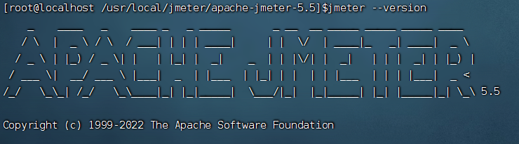

一、Jmeter 

压测工具：

二、安装Jmeter

- 在 /usr/local/ 路径下床架  jmeter文件夹 存放压缩包以及文件

```c
cd /usr/local/
mkdir jmeter
cd jmeter
```

- 下载或本地上传jmeter压缩包

```c
wget http://mirrors.tuna.tsinghua.edu.cn/apache//jmeter/binaries/apache-jmeter-5.5.tgz
```

- 进行解压

```c
tar zxvf apache-jmeter-5.5.tgz
```

- 配置jmeter环境变量 ，是通过用户目录下的用户配置文件{.bash_profile}实现的，此文件为隐藏文件，可通过 ll -al 查看。将JMeter的环境变量配置文件中，即可实现指定用户的环境配置。添加内容如下：

```c
$ vi .bash_profile

export JMETER_HOME=/usr/local/jmeter/apache-jmeter-5.5
export CLASSPATH=$JMETER_HOME/lib/ext/ApacheJMeter_core.jar:$JMETER_HOME/lib/jorphan.jar:$JMETER_HOME/lib/logkit-2.0.jar:$CLASSPATH
export PATH=$JMETER_HOME/bin:$PATH:$HOME/bin
```

- 为所有用户配置环境变量，是通过修改系统变量配置实现的，添加的内容同指定用户的一致，只需要在配置时注意原有环境变量的引用即可

```c
$ vi /etc/profile
#修改内容同以上用户环境变量配置
```

- 修改配置文件后，执行如下命令使配置生效：

```c
# 指定用户：
$ source ~/.bash_profile

# 系统变量：
$ source /etc/profile
```

- 验证：

```c
jmeter --version
```



