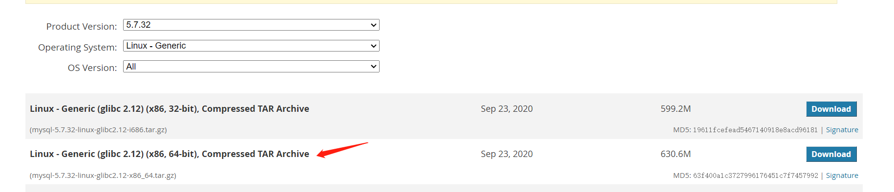
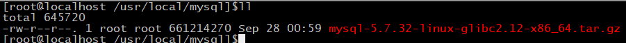
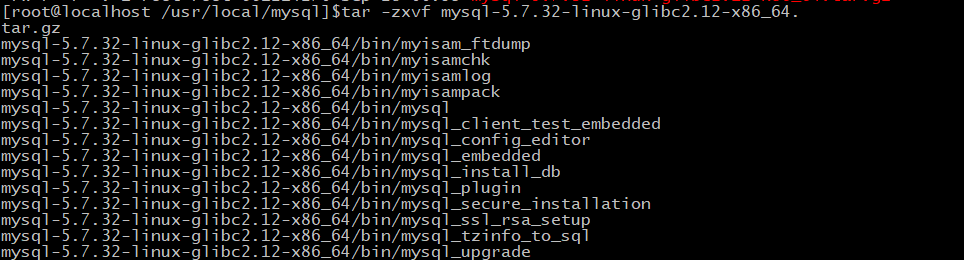
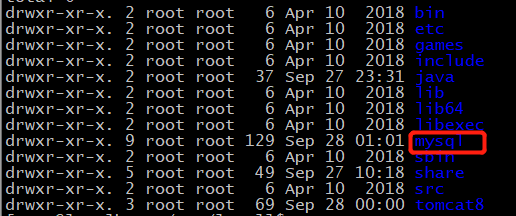
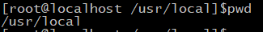
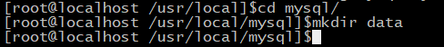
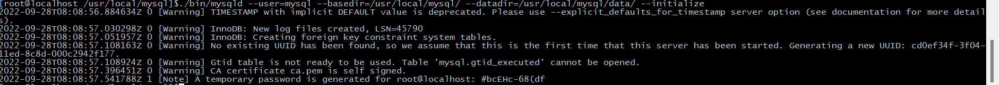
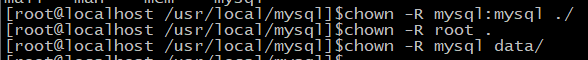
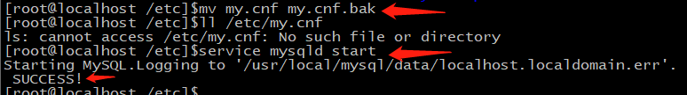
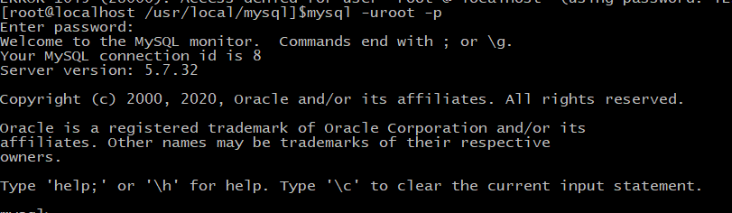

# 三、安装MySQL（64位）

- 下载MySQl Community Server（社区版）mysql

​	地址 https://downloads.mysql.com/archives/community/



- 进入usr/local/ 目录创建mysql文件夹
- 将mysql安装包上传至linux中



- 使用命令 ，解压缩mysql的tar包

```c
tar -zxvf mysql-5.7.32-linux-glibc2.12-x86_64.tar.gz 
```



- 对解压的文件夹命名（最好修改，方便后续操作）

```c
mv  mysql-5.7.32-linux-glibc2.12-x86_64/ mysql
```



- 将mysql文件夹放到 /usr/local 目录下 （已经在的话请忽略）



- 添加用户组

```c
groupadd mysql
```

- 添加用户mysql 到用户组mysql

```c
useradd -g mysql mysql
```

- 准备开始安装

​	在/usr/local/mysql目录下新建data文件夹,以后的数据库文件将放在这里

```c
cd mysql
mkdir data
```



- mysql_install_db 被废弃了，取而代之的是 mysqld –-initialize (需要注意的是,有时候使用这个指令出错的话,将–initialize放在命令的最后面,即： ./bin/mysqld --user=xxx --basedir=xx --initizlize

注意将最后的密码记下来，为mysql初始密码

```c
sudo ./bin/mysqld --user=mysql --basedir=/usr/local/mysql/ --datadir=/usr/local/mysql/data/ --initialize
```



- 修改目录下所有文件的所有者
  将mysql/目录下除了data/目录的所有文件，改回root用户所有

```c
chown -R mysql:mysql ./
chown -R root .
chown -R mysql data/
```



- 复制启动文件

```c
cp support-files/mysql.server /etc/init.d/mysqld
chmod 755 /etc/init.d/mysqld
cp /usr/local/mysql/bin/my_print_defaults /usr/bin/
```

- 启动服务

```c
service mysqld start
```

- 登录mysql：mysql -uroot -p

大坑！！！  如果启动时报错 

【mysql报错】mysqld_safe Directory ‘/var/lib/mysql‘ for UNIX socket file don‘t exists.

- 查找  文件

```c
ll /etc/my.cnf
```


- 将此文件重命名或删除，再重新启动mysql

```c
mv my.cnf my.cnf.bak
```

- 检查是否还存在

```c
ll /etc/my.cnf
```

- 重新启动

```c
service mysqld start
```



参考链接  https://blog.csdn.net/baiyi6340/article/details/102342434

- 使用命令登录

```c
mysql -uroot -p
```

若出现   登录mysql报错-bash: mysql: 未找到命令

则原因:这是由于系统默认会查找/usr/bin下的命令，如果这个命令不在这个目录下，当然会找不到命令，我们需要做的就是映射一个链接到/usr/bin目录下，相当于建立一个链接文件。
首先得知道mysql命令或mysqladmin命令的完整路径，比如mysql的路径是：/usr/local/mysql/bin/mysql，我们则可以这样执行命令：

```c
ln -s /usr/local/mysql/bin/mysql /usr/bin
```

参考地址：https://blog.csdn.net/cs23405/article/details/82022047

- 再次尝试登录



- 修改初始密码

```mysql
ALTER USER 'root'@'localhost'IDENTIFIED BY '新密码';
```

注意：   这里的MySQL 启动与停止命令为：

```mysql
service mysqld stop
service mysqld start
```

