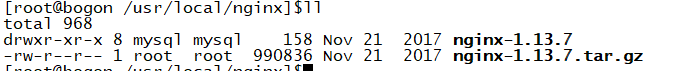
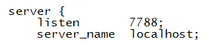
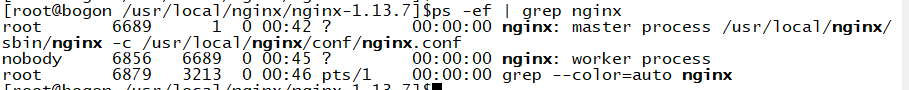
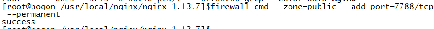
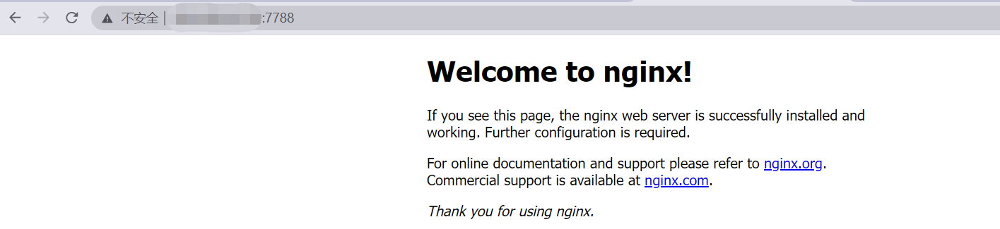

# 一、安装nginx

- 在 /usr/local/ 中创建新的文件夹 nginx

```c
mkdir nginx;
```

- 安装依赖包

```c
//一键安装上面四个依赖
yum -y install gcc zlib zlib-devel pcre-devel openssl openssl-devel
```


- 下载并解压安装包

```c
cd nginx
//下载tar包
wget http://nginx.org/download/nginx-1.13.7.tar.gz
tar -xvf nginx-1.13.7.tar.gz
```



```c
//进入nginx目录
cd /usr/local/nginx
//进入目录
cd nginx-1.13.7
//执行命令 考虑到后续安装ssl证书 添加两个模块
./configure --with-http_stub_status_module --with-http_ssl_module
//执行make命令
make
//执行make install命令
make install
```

- 启动nginx服务

```c
/usr/local/nginx/sbin/nginx -c /usr/local/nginx/conf/nginx.conf
```

- 配置nginx.conf

```c
# 打开配置文件
vi /usr/local/nginx/conf/nginx.conf
```

- 将端口号改成8089(随便挑个端口)，因为可能apeache占用80端口，apeache端口尽量不要修改，我们选择修改[nginx](https://so.csdn.net/so/search?q=nginx&spm=1001.2101.3001.7020)端口。



- 重启nginx

```c
/usr/local/nginx/sbin/nginx -s reload
```

- 查看nginx进程是否启动：

```c
ps -ef | grep nginx
```



- 若想使用外部主机访问nginx，需要关闭服务器防火墙或开放nginx服务端口，端口为上一步nginx.conf的配置端口：

```c
firewall-cmd --zone=public --add-port=7788/tcp --permanent
```



- 重启防火墙：

```c
firewall-cmd --reload
```

- 访问测试



- 安装完成一般常用命令

进入安装目录中，

命令： cd /usr/local/nginx/sbin

启动，关闭，重启，命令：

./nginx 启动

./nginx -s stop 关闭

./nginx -s reload 重启
