环境：

- Redis版本 5.0.4

- 服务器版本 Linux CentOS 7 64位

一、安装Redis：

- 在 /usr/local/ 下创建redis文件夹

```c
mkdir redis
cd /usr/local/redis
```

- 下载压缩包并解压

```c
wget http://download.redis.io/releases/redis-5.0.7.tar.gz
```


- 解压到当前目录

```c
tar -zvxf redis-5.0.7.tar.gz
```

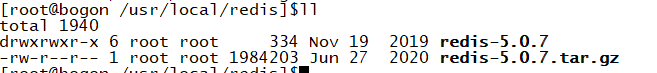

- 进入redis文件夹中使用make 执行编译命令

```c
make
```

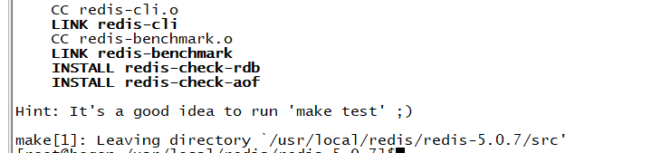

- 进行安装(这是文件路径)

```c
make PREFIX=/usr/local/redis-5.0.7 install
```

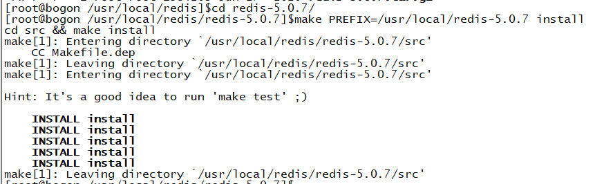

- 启动redis
- 在目录/usr/local/redis-5.0.7 输入下面命令启动redis

```c
./bin/redis-server& ./redis.conf
```

- 若无法启动 查询目录下是否存在bin 目录  如果不存在，查询bin目录并将目录移动到该目录下

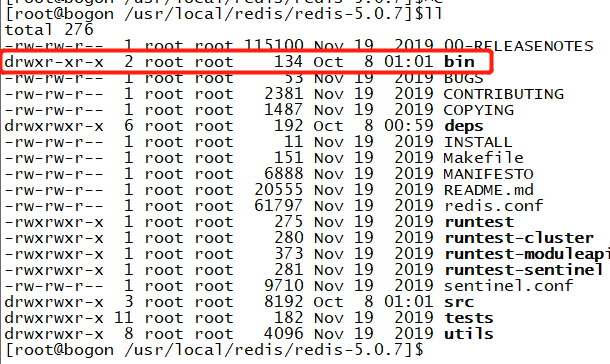

```c
whereis bin
```

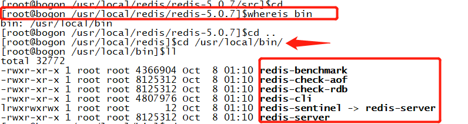

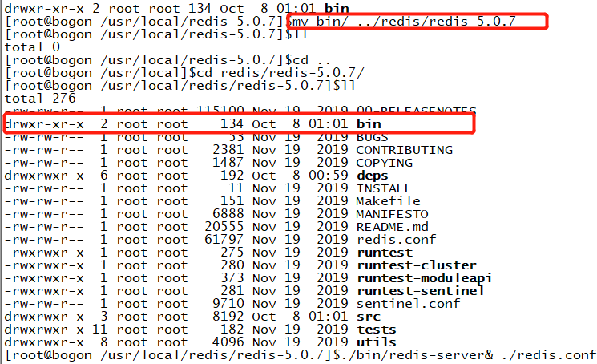

- 再次启动redis

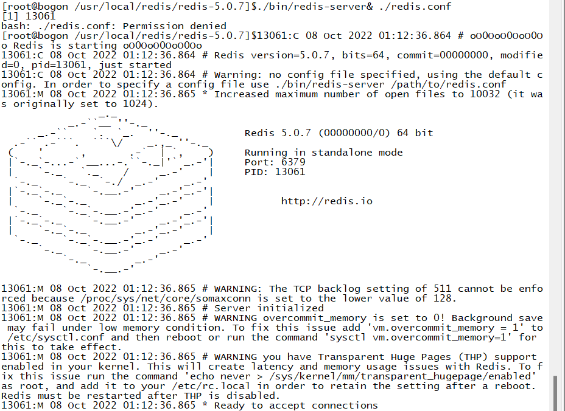

- 将redis修改问后台运行 

```c
vi redis.conf
```

- 输入   ？daemonize   来查找 使用 n进行查找
- 找到之后将no改成yes

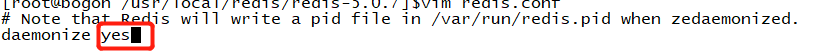

- 修改完成后保存退出即可

- 输入./redis-server打开服务器

      再在后台另外连接一台服务器（也就是重新打开一个窗口）
      
      进入安装redis的安装目录（/usr/local/redis）
      
      进入bin目录
      
      输入./redis-cli启动客户端
      
      即可对redis数据库进行操作。

- 测试  
- 将redis进程全部杀死

```c
killall redis-server
```

- 开启redis服务

```c
 ./bin/redis-server redis.conf
```

- 可以使用pstree查看是否启动  或者 ps -ef |grep redis


- 用redis-cli客户端连接redis

```c
./bin/redis-cli 
```

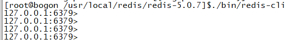

- 查看所有命令

```c
keys *
```


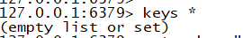

- 添加一条数据

```c
set mykey "axian"
```

- 读取一条数据4

```c
get mykey
```

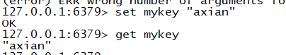