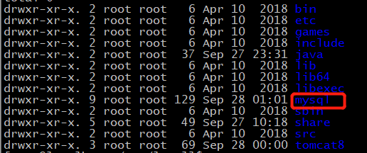
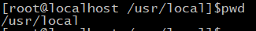
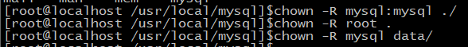

# 一、安装jdk：

详情来源：https://blog.csdn.net/zhang_m_h/article/details/106833492?spm=1001.2014.3001.5502

- 进入到/usr/local 目录下，创建文件夹存放下载的安装包  这里放在了/usr/local/java中

- ```c
  cd /usr/local
  mkdir java
  ```

**先查看centos中自带的jdk并卸载**

```c
[root@root ~]# rpm -qa | grep java     //查看
tzdata-java-2016c-1.el6.noarch
java-1.6.0-openjdk-1.6.0.38-1.13.10.4.el6.x86_64
java-1.7.0-openjdk-1.7.0.99-2.6.5.1.el6.x86_64
[root@root ~]# rpm -e --allmatches --nodeps java-1.6.0-openjdk-1.6.0.38-1.13.10.4.el6.x86_64   //卸载
[root@root ~]# rpm -e --allmatches --nodeps java-1.7.0-openjdk-1.7.0.99-2.6.5.1.el6.x86_64 //卸载
[root@root ~]# rpm -qa | grep java   //再次查看
tzdata-java-2016c-1.el6.noarch
```

- 在线下载命令

```c
 wget --no-check-certificate --no-cookies --header "Cookie: oraclelicense=accept-securebackup-cookie" http://download.oracle.com/otn-pub/java/jdk/8u131-b11/d54c1d3a095b4ff2b6607d096fa80163/jdk-8u131-linux-x64.rpm
```


- 查看是否存在安装包

```c
ls
```

- 给安装包添加执行权限，添加后文件名颜色会发生改变

```c
chmod +x jdk-8u131-linux-x64.rpm
```

- 执行rmp安装

```c
rpm -ivh jdk-8u131-linux-x64.rpm
```


- 查看是否安装成功，安装位置在/usr/java目录下

```c
java -version
```


- 配置JDK环境变量

```c
vi /etc/profile
```

在文件的最后添上如下命令

```c
export JAVA_HOME=/usr/java/jdk1.8.0_131	
export JRE_HOME=${JAVA_HOME}/jre
export CLASSPATH=.:${JAVA_HOME}/lib:${JRE_HOME}/lib:$CLASSPATH
export JAVA_PATH=${JAVA_HOME}/bin:${JRE_HOME}/bin
export PATH=$PATH:${JAVA_PATH}
```


- 编辑完成后保存退出，使profile文件更改立即生效

```c
source /etc/profile
```

- 查看命令是否好使

```c
javac
```


# 二、安装tomcat

- 安装tomcat需要先有java环境，先配置好上一步环境
- 首先去下载tomcat安装包https://link.csdn.net/?target=https%3A%2F%2Ftomcat.apache.org%2Fdownload-80.cgi


- 下载成功后将压缩包传到linux服务器上，一般放在/usr/local下面。在local下创建tomcat文件夹，将压缩包放进去后解压

```c
sudo tar -zxvf apache-tomcat-8.5.56.tar.gz
```


-  解压后进入解压的目录下，bin目录下,启动tomcat

```c
./startup.sh
```


- 记得开放防火墙8080端口，然后根据ip:8080去访问 ,马赛克部分是你的服务器IP地址


## 开放端口

linux [centos7](https://so.csdn.net/so/search?q=centos7&spm=1001.2101.3001.7020) 默认防火墙是关闭的，设置了开启端口后一定要重启防火墙，否则端口开启会不起作用

- 查看已开启的端口

```c
firewall-cmd --list-ports
```

- 查看防火墙状态

```c
firewall-cmd --state
```

- 开启防火墙

```c
systemctl start firewalld
```

- 开启端口

```c
firewall-cmd --zone=public --add-port=8080/tcp --permanent
```

- 重启防火墙

```c
firewall-cmd --reload
```

- 再次查看已开启的端口

```c
firewall-cmd --list-ports
```


# 三、安装MySQL（64位）

- 下载MySQl Community Server（社区版）mysql

​	地址 https://downloads.mysql.com/archives/community/


- 进入usr/local/ 目录创建mysql文件夹
- 将mysql安装包上传至linux中


- 使用命令 ，解压缩mysql的tar包

```c
tar -zxvf mysql-5.7.32-linux-glibc2.12-x86_64.tar.gz 
```


- 对解压的文件夹命名（最好修改，方便后续操作）

```c
mv  mysql-5.7.32-linux-glibc2.12-x86_64/ mysql
```



- 将mysql文件夹放到 /usr/local 目录下 （已经在的话请忽略）



- 添加用户组

```c
groupadd mysql
```

- 添加用户mysql 到用户组mysql

```c
useradd -g mysql mysql
```

- 准备开始安装

​	在/usr/local/mysql目录下新建data文件夹,以后的数据库文件将放在这里

```c
cd mysql
mkdir data
```


- mysql_install_db 被废弃了，取而代之的是 mysqld –-initialize (需要注意的是,有时候使用这个指令出错的话,将–initialize放在命令的最后面,即： ./bin/mysqld --user=xxx --basedir=xx --initizlize

注意将最后的密码记下来，为mysql初始密码

```c
sudo ./bin/mysqld --user=mysql --basedir=/usr/local/mysql/ --datadir=/usr/local/mysql/data/ --initialize
```


- 修改目录下所有文件的所有者
  将mysql/目录下除了data/目录的所有文件，改回root用户所有

```c
chown -R mysql:mysql ./
chown -R root .
chown -R mysql data/
```



- 复制启动文件

```c
cp support-files/mysql.server /etc/init.d/mysqld
chmod 755 /etc/init.d/mysqld
cp /usr/local/mysql/bin/my_print_defaults /usr/bin/
```

- 启动服务

```c
service mysqld start
```

- 登录mysql：mysql -uroot -p

大坑！！！  如果启动时报错 

【mysql报错】mysqld_safe Directory ‘/var/lib/mysql‘ for UNIX socket file don‘t exists.

- 查找  文件

```c
ll /etc/my.cnf
```


- 将此文件重命名或删除，再重新启动mysql

```c
mv my.cnf my.cnf.bak
```

- 检查是否还存在

```c
ll /etc/my.cnf
```

- 重新启动

```c
service mysqld start
```


参考链接  https://blog.csdn.net/baiyi6340/article/details/102342434

- 使用命令登录

```c
mysql -uroot -p
```

若出现   登录mysql报错-bash: mysql: 未找到命令

则原因:这是由于系统默认会查找/usr/bin下的命令，如果这个命令不在这个目录下，当然会找不到命令，我们需要做的就是映射一个链接到/usr/bin目录下，相当于建立一个链接文件。
首先得知道mysql命令或mysqladmin命令的完整路径，比如mysql的路径是：/usr/local/mysql/bin/mysql，我们则可以这样执行命令：

```c
ln -s /usr/local/mysql/bin/mysql /usr/bin
```

参考地址：https://blog.csdn.net/cs23405/article/details/82022047

- 再次尝试登录


- 修改初始密码

```mysql
ALTER USER 'root'@'localhost'IDENTIFIED BY '新密码';
```

注意：   这里的MySQL 启动与停止命令为：

```mysql
service mysqld stop
service mysqld start
```

