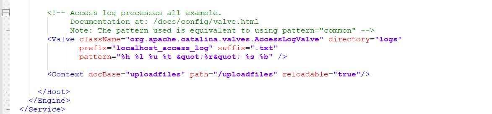
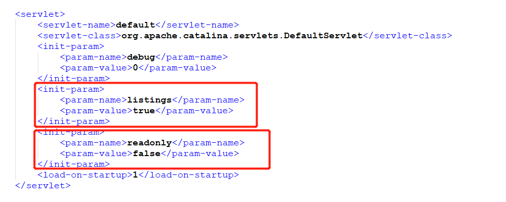
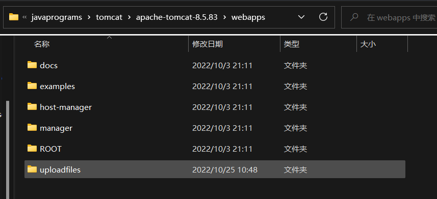
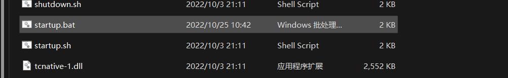
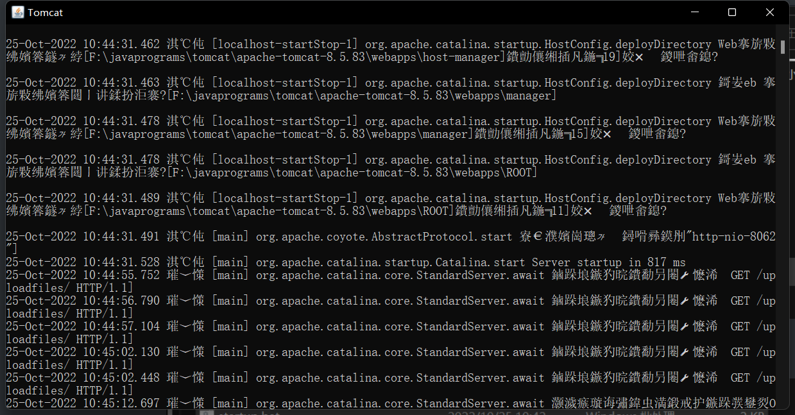
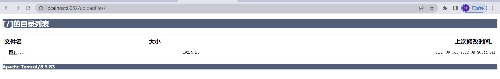

参考链接： https://blog.csdn.net/user__s/article/details/127304248

一、配置环境 

- 若本机有多个tomcat  请查看tomcat配置教程
- 配置完成后  在Host 标签结尾加入 Context 标签  （conf 目录下server.xml  文件）

```xml
<Context docBase="uploadfiles" path="/uploadfiles" reloadable="true"/>
```



二、conf  目录下  修改web.xml文件



上面为 可以列表展示文件  下面为 可读写文件

```xml
<servlet>
        <servlet-name>default</servlet-name>
        <servlet-class>org.apache.catalina.servlets.DefaultServlet</servlet-class>
        <init-param>
            <param-name>debug</param-name>
            <param-value>0</param-value>
        </init-param>
        <init-param>
            <param-name>listings</param-name>
            <param-value>true</param-value>
        </init-param>
		<init-param>
            <param-name>readonly</param-name>
            <param-value>false</param-value>
        </init-param>
        <load-on-startup>1</load-on-startup>
    </servlet>
```

三、在webapps下 创建 目录 uploadfiles 文件夹 



四、 在bin 目录下点击 startup.bat 启动测试





- 通过http://localhost:8062/uploadfiles/访问文件服务器下的文件，出现如下界面，说明文件服务器准备就绪；

  端口号就是刚在配置文件中配置的端口号，后面的路径就是设置用来存放文件的文件夹

- 启动之后访问路径即可



 接下来就可以使用文件上传下载的代码在服务器上进行操作了，或者直接放进目录下，在浏览器也是可以访问的；

上面的配置方法在云端服务器也是适用的；可以自行配置；