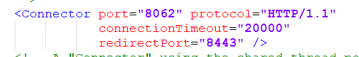

配置多个tomcat   参考链接： https://blog.csdn.net/weixin_44953227/article/details/113562831

tomcat 下载 ：https://tomcat.apache.org/

一、 放置到文件位置 并解压缩 

二、配置环境变量：

CATALINA_BASE 和 CATALINA_HOME 被之前的tomcat使用了，取两个新的名字

变量名: CATALINA_BASE03

变量值: F:\javaprograms\tomcat\apache-tomcat-8.5.83（Tomcat目录）

变量名: CATALINA_HOME03

变量值: F:\javaprograms\tomcat\apache-tomcat-8.5.83（Tomcat目录）

三、修改tomcat配置文件 

- 在tomcat目录的bin下  修改 `startup.bat` 和 `catalina.bat` 文件
  - 把 startup.bat 里面的 CATALINA_HOME 全部替换为上面配置的 CATALINA_HOME03
  - 把 catalina.bat 里面的 CATALINA_HOME 全部替换为上面配置的 CATALINA_HOME03，以及 CATALINA_BASE 全部替换为上面配置的 CATALINA_BASE03

四、修改tomcat目录下 conf中`server.xml` 文件 （修改端口）：

五、启动测试：

点击 tomcat 里面 bin 目录下的 startup.bat 启动服务，访问 localhost:8062

如果访问发现还是原来的tomcat就看看 `startup.bat` 和 `catalina.bat` 这两个文件是不是没有修改

如果启动失败那就查看是不是端口冲突了

