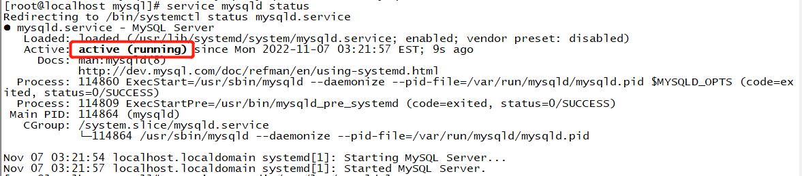
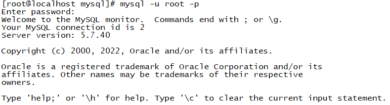
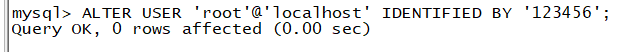
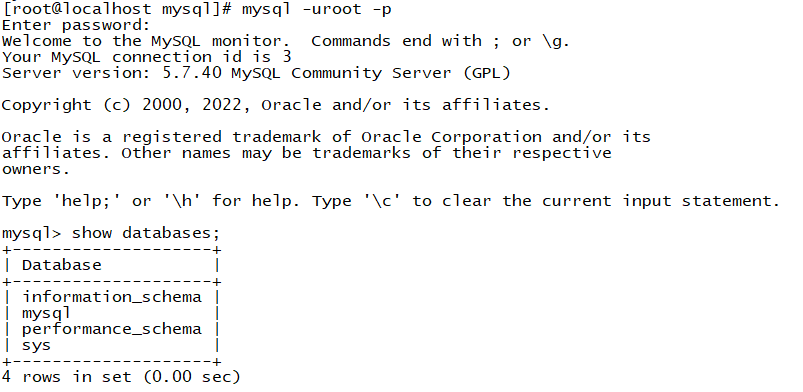

# 一、命令安装mysql：

- 查看是否已经安装mysql：

```c
rpm -qa | grep mysql
```

- 若无输出，则没有；若有文件输出，需要删除文件

```c
rpm -e 文件名
```

- 下载官方mysql包

```c
wget -i -c http://dev.mysql.com/get/mysql57-community-release-el7-10.noarch.rpm
```

- 安装mysql包

```c
yum -y install mysql57-community-release-el7-10.noarch.rpm
```

- **安装 MySQL**

```c
yum -y install mysql-community-server
```

若出现

```c
Downloading packages:
warning: /var/cache/yum/x86_64/7/mysql57-community/packages/mysql-community-common-5.7.38-1.el7.x86_64.rpm: Header V4 RSA/SHA256 Signature, key ID 3a79bd29: NOKEY
Retrieving key from file:///etc/pki/rpm-gpg/RPM-GPG-KEY-mysql


The GPG keys listed for the "MySQL 5.7 Community Server" repository are already installed but they are not correct for this package.
Check that the correct key URLs are configured for this repository.


 Failing package is: mysql-community-common-5.7.38-1.el7.x86_64
 GPG Keys are configured as: file:///etc/pki/rpm-gpg/RPM-GPG-KEY-mysql
--nogpgcheck
```

则在后面加上  –nogpgcheck   禁掉GPG验证检查

```c
yum -y install mysql-community-server –nogpgcheck
```

- **启动 Mysql 服务**

```c
systemctl start mysqld.service
```

-  **查看 Mysql 运行状态**

```c
service mysqld status
```



- 查看初始密码

```c
grep 'password' /var/log/mysqld.log
```


- 登录mysql

```c
mysql -uroot -p
```



- 修改初始密码，若不修改则无法使用；修改密码时若提示为弱密码 执行一下语句


```c
set global validate_password_policy=0;
set global validate_password_length=1;
```

- 再次进行修改密码

```c
ALTER USER 'root'@'localhost' IDENTIFIED BY '123456';
```



- 再次尝试登录mysql，使用 show databases；

